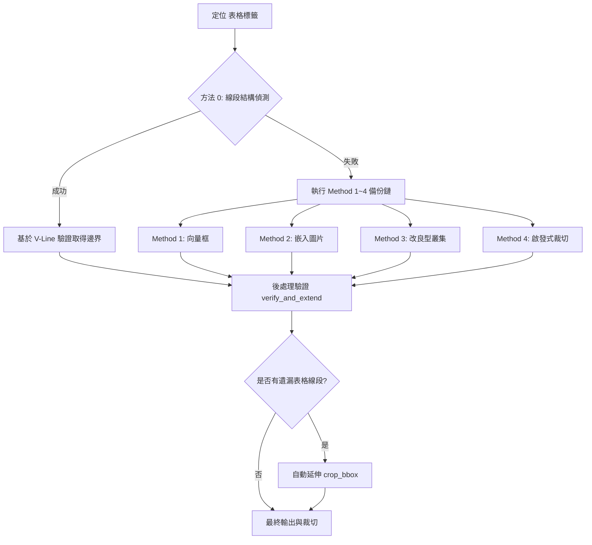

# 表格處理技巧 — 國中會考社會科題本 PDF 表格偵測與裁切

本文件整理自「國中教育會考社會科題庫與線上測驗系統 (JHexam)」專案，深入探討如何利用 Python 的 PyMuPDF (fitz) 與 Pillow 套件，從 PDF 檔案中高精確度地識別、定位與裁切表格。此文件為未來將此功能封裝成獨立 IDE 技能 (Skill) 作準備。

---

## 1. 背景與遇到的困難

在處理國中會考 PDF 題本時，表格的自動偵測與裁切面臨以下挑戰：

### 1.1 分段式垂直線 (Segmented Vertical Lines)
PDF 格式中的表格通常**不具備單一的向量矩形框架 (Frame)**，而是由多條獨立的水平線與垂直線拼接而成。更棘手的是，垂直分隔線往往是**分段繪製的短線**（例如每段長度約為一個行高，約 36pt）。這些段落之間存在微小的間隙（0.3pt - 0.5pt），傳統的鄰近元素叢集 (Clustering) 演算法若設定的容忍度不足，極易在表格行間將其截斷，導致**裁切不完整**（如僅裁切到表格上半部）。

### 1.2 題目字體底線與小裝飾點的干擾 (Decorative Underlines)
在表格的同一高度區間內，左側或右側的題目文字中可能包含**底線裝飾線**或**引導點**。在進行繪圖元素 (Drawings) 叢集時，這些無關的橫線會被納入叢集計算，導致 x 軸中心嚴重偏離，進而破壞整個表格的叢集合併邏輯。

### 1.3 標籤高度限制與高度截斷
之前的演算法對表格高度有硬性限制（例如限制表格最大高度為標籤下方 200pt）。然而，部分表格（如包含大量選項或多行數據的長表格）高度會超過 200pt，硬性限制會導致表格底部被切掉。

### 1.4 中文編碼陷阱
部分題本中，表格標籤 `表(一)` 中的國字「一」在 PDF 中被編碼為**注音符號 `ㄧ` (U+3127)**，若僅使用一般的中文字元匹配，會導致整個偵測流程失效。

---

## 2. 核心原理與處理方式

為了解決上述困難，我們設計了 **「線段結構偵測 + V-Line 欄位驗證 + 後處理延伸」** 的多重保障演算法。



### 2.1 表格偵測優先鏈 (Method Priority Chain)
1. **Method 0: 線段結構偵測 (Line-structure Table Detection)**：最可靠的方法。直接分析 PDF 的橫線與直線，重構表格格線，無視無關文字與小裝飾。
2. **Method 1: 向量框架偵測 (Frame Rect Detection)**：若表格具有完整的背景框或外框，則直接取用。
3. **Method 2: 嵌入式圖片偵測 (Embedded Image Detection)**：若表格在 PDF 中是以圖片形式嵌入，則使用圖片的 BBox。
4. **Method 3: 改良型叢集偵測 (Cluster Detection)**：針對無法透過純線段重構的非典型表格，使用寬容度更高的叢集法。
5. **Method 4: 啟發式裁切 (Heuristic Fallback Crop)**：當上述方法皆失敗時，依據標籤位置與版面結構進行安全預設範圍裁切。

---

## 3. 核心演算法解析

### 3.1 基於線段結構的表格偵測 (`detect_table_from_lines`)
此方法不依賴鄰近元素的物理距離叢集，而是直接提取頁面中的所有水平線 (H-lines) 與垂直線 (V-lines)，並透過以下步驟進行過濾與重構：

1. **短線段預合併 (H-Line Segment Merging)**：
   表格中同一橫列的線條經常在 PDF 中被拆成多個獨立的短線段（特別是各欄欄寬線）。我們首先在 `merge_h_lines` 中，將 y 軸座標非常接近（1.5pt 內）且在 x 軸上相連或重疊（間距 ≤5pt）的水平線段**預先合併成完整的橫線**。這使得單欄短格線能夠正確結合成完整的表格列寬，同時讓長表格列順利通過最小長度檢驗。
2. **對齊過濾**：僅保留位於表格標籤 `表(N)` 下方，且 x 中心與標籤 x 相近（±250pt 內）的合併後水平線，且線長須大於 50pt，徹底過濾與表格無關的短底線或題型引導點。
3. **尋找欄分割線 (V-Lines)**：利用初步確定的表格頂底邊界 `[y_top, y_bot]`，找出在此區域內的所有垂直線，並整理出表格的欄位分界點 `col_xs`（若 x 座標相差在 5pt 內則進行去重合併）。
4. **驗證列的連續性**：如果兩條橫線之間的 y 軸間距大於 80pt，此間距不尋常。此時必須驗證這條橫線在該位置是否有垂直分割線交會 (`is_table_row_y`)。若有，說明該列是表格的一部份（例如特別高的單元格）；若無，則停止向下追蹤，避免將表格下方的其他圖形橫線誤認進來。

### 3.2 後處理驗證與自動延伸 (`verify_and_extend`)
作為最後的安全防線，在偵測出初步裁切範圍 `crop_bbox` 後，演算法會檢查該範圍下方 100pt 內是否還有符合以下條件的水平線：
- 其 x 左右邊界與原本的 `crop_bbox` 的 x0, x1 誤差小於 30pt。
- 在該 y 軸位置上，至少有 2 個以上的 V-line 與原本的欄位分界 `col_xs` 對齊。

如果存在這樣的線段，說明表格被之前的步驟提前截斷了（常見於 cluster 偵測）。此時，演算法會自動調整 `crop_bbox` 的下邊界 `y1`，將其向下延伸至該橫線的 y 座標加 5pt 的位置。

---

## 4. 完整實作程式碼

以下為專案中使用的完整 Python 實作代碼，可用作日後擴充為 Skill 的基礎腳本：

```python
#!/usr/bin/env python3
"""
crop_tables.py — Unified table cropping for all years (112/113/114).
"""
import fitz
import os
import re
import sys
import json
from PIL import Image

sys.stdout.reconfigure(encoding='utf-8')

ROOT_DIR = os.path.dirname(os.path.dirname(os.path.abspath(__file__)))
OUT_DIR = os.path.join(ROOT_DIR, 'web', 'pic')
DPI = 200

# 支援漢字與注音符號 'ㄧ' 的轉換對照表
CN_DIGITS = {
    '一': 1, '二': 2, '三': 3, '四': 4, '五': 5,
    '六': 6, '七': 7, '八': 8, '九': 9, '\u3127': 1,
}

def chinese_to_int(cn):
    """將中文數字（含注音 ㄧ）轉為整數"""
    if cn == '十':
        return 10
    if cn.startswith('十'):
        return 10 + CN_DIGITS.get(cn[1:], 0)
    if cn.endswith('十'):
        return CN_DIGITS.get(cn[0], 1) * 10
    if '十' in cn:
        parts = cn.split('十')
        return CN_DIGITS.get(parts[0], 0) * 10 + CN_DIGITS.get(parts[1], 0)
    if cn in CN_DIGITS:
        return CN_DIGITS[cn]
    try:
        return int(cn)
    except (ValueError, TypeError):
        return None

def find_table_labels(page):
    """搜尋頁面中所有單獨的 表(N) 標籤位置"""
    labels = []
    blocks = page.get_text("dict")["blocks"]
    for b in blocks:
        if b["type"] == 0:
            for line in b.get("lines", []):
                text = "".join(s["text"] for s in line.get("spans", [])).strip()
                # 匹配 表(一) 至 表(十)，相容注音
                m = re.match(r'^表\(([一二三四五六七八九十\u3127\d]+)\)$', text)
                if m:
                    num = chinese_to_int(m.group(1))
                    if num:
                        labels.append({
                            "id": text,
                            "num": num,
                            "y": line["bbox"][1],
                            "x": (line["bbox"][0] + line["bbox"][2]) / 2,
                            "bbox": list(line["bbox"]),
                        })
    return labels

def get_page_lines(page):
    """提取頁面上所有的水平線與垂直線"""
    drawings = page.get_drawings()
    h_lines = []
    v_lines = []
    for d in drawings:
        for item in d.get("items", []):
            if item[0] == "l":
                p1, p2 = item[1], item[2]
                dy = abs(p1.y - p2.y)
                dx = abs(p1.x - p2.x)
                if dy < 2 and dx > 15:  # 水平線（包含小於 30pt 的窄欄）
                    y = (p1.y + p2.y) / 2
                    x0 = min(p1.x, p2.x)
                    x1 = max(p1.x, p2.x)
                    h_lines.append({"y": y, "x0": x0, "x1": x1, "len": dx})
                elif dx < 2 and dy > 15:  # 垂直線
                    x = (p1.x + p2.x) / 2
                    y0 = min(p1.y, p2.y)
                    y1 = max(p1.y, p2.y)
                    v_lines.append({"x": x, "y0": y0, "y1": y1, "len": dy})
    return h_lines, v_lines

def find_column_xs(v_lines, y_top, y_bot, x_min, x_max):
    """在指定區間內尋找垂直欄分界線的 x 座標點"""
    col_xs = set()
    for l in v_lines:
        if (l["x"] >= x_min - 10 and l["x"] <= x_max + 10
                and l["y0"] >= y_top - 5 and l["y1"] <= y_bot + 5):
            col_xs.add(round(l["x"]))
    # 合併相近的 x 座標（5pt 容忍度）
    merged = []
    for x in sorted(col_xs):
        if merged and abs(x - merged[-1]) < 5:
            continue
        merged.append(x)
    return merged

def is_table_row_y(y, v_lines, col_xs, tolerance=5):
    """檢查 y 軸位置上，是否有垂直分隔線穿過，用於驗證該列是否屬於同一個表格"""
    if len(col_xs) < 2:
        return True
    matches = 0
    for cx in col_xs:
        for vl in v_lines:
            if (abs(vl["x"] - cx) < tolerance
                    and vl["y0"] <= y + 2
                    and vl["y1"] >= y - 2):
                matches += 1
                break
    return matches >= 2

def merge_h_lines(h_lines):
    """
    將同行（y軸相差1.5pt內）且在x軸上重疊或相鄰（間距小於5pt）的水平線段合併。
    """
    if not h_lines:
        return []
    groups = []
    for l in sorted(h_lines, key=lambda x: x["y"]):
        added = False
        for g in groups:
            if abs(g[0]["y"] - l["y"]) < 1.5:
                g.append(l)
                added = True
                break
        if not added:
            groups.append([l])
            
    merged = []
    for g in groups:
        g.sort(key=lambda x: x["x0"])
        row_merged = []
        for l in g:
            if not row_merged:
                row_merged.append(dict(l))
            else:
                last = row_merged[-1]
                if l["x0"] - last["x1"] <= 5:
                    last["x1"] = max(last["x1"], l["x1"])
                    last["len"] = last["x1"] - last["x0"]
                else:
                    row_merged.append(dict(l))
        merged.extend(row_merged)
    return merged

# ── Method 0: 線段結構偵測 ──
def detect_table_from_lines(page, label):
    ly = label["y"]
    lx = label["x"]
    h_lines, v_lines = get_page_lines(page)
    merged_h = merge_h_lines(h_lines)

    # 篩選標籤下方且 x 對齊的候選水平線 (寬鬆至 250pt 以防靠右或靠左標籤)
    candidates_h = [
        l for l in merged_h
        if ly - 5 <= l["y"] <= ly + 500
        and l["len"] > 50
        and abs((l["x0"] + l["x1"]) / 2 - lx) < 250
    ]
    if not candidates_h:
        return None

    # 水平線按 y 軸排序並進行行內合併
    candidates_h.sort(key=lambda l: l["y"])
    row_ys = []
    row_x0s = []
    row_x1s = []
    for l in candidates_h:
        if row_ys and abs(l["y"] - row_ys[-1]) < 3:
            row_x0s[-1] = min(row_x0s[-1], l["x0"])
            row_x1s[-1] = max(row_x1s[-1], l["x1"])
        else:
            row_ys.append(l["y"])
            row_x0s.append(l["x0"])
            row_x1s.append(l["x1"])

    if len(row_ys) < 2:
        return None

    # 取中位數確定表格的主體寬度與水平位置
    med_x0 = sorted(row_x0s)[len(row_x0s) // 2]
    med_x1 = sorted(row_x1s)[len(row_x1s) // 2]

    table_row_ys = []
    table_x0 = med_x0
    table_x1 = med_x1
    for i, y in enumerate(row_ys):
        if abs(row_x0s[i] - med_x0) < 30 and abs(row_x1s[i] - med_x1) < 30:
            table_row_ys.append(y)
            table_x0 = min(table_x0, row_x0s[i])
            table_x1 = max(table_x1, row_x1s[i])

    if len(table_row_ys) < 2:
        return None

    # 初步尋找欄位 V-Lines 分割點
    preliminary_top = table_row_ys[0]
    preliminary_bot = table_row_ys[-1]
    col_xs = find_column_xs(v_lines, preliminary_top, preliminary_bot, table_x0, table_x1)

    # 連續性追蹤：大間距時驗證是否有垂直線支持，以防誤將下方無關線段納入
    valid_chain = [table_row_ys[0]]
    for i in range(1, len(table_row_ys)):
        gap = table_row_ys[i] - valid_chain[-1]
        if gap > 80:
            if len(col_xs) >= 2 and is_table_row_y(table_row_ys[i], v_lines, col_xs):
                valid_chain.append(table_row_ys[i])
            else:
                break
        else:
            valid_chain.append(table_row_ys[i])

    if len(valid_chain) < 2:
        return None

    # 利用最終確定的範圍微調 x 左右邊界
    table_y_top = valid_chain[0]
    table_y_bot = valid_chain[-1]
    final_col_xs = find_column_xs(v_lines, table_y_top, table_y_bot, table_x0, table_x1)
    if final_col_xs:
        table_x0 = min(table_x0, min(final_col_xs))
        table_x1 = max(table_x1, max(final_col_xs))

    crop_bbox = [
        table_x0 - 3,
        min(ly - 3, table_y_top - 10),
        table_x1 + 3,
        table_y_bot + 5,
    ]

    return {
        "label_id": label["id"],
        "label_num": label["num"],
        "bbox": [table_x0, table_y_top, table_x1, table_y_bot],
        "crop_bbox": crop_bbox,
        "method": "lines",
        "rows": len(valid_chain),
        "col_xs": final_col_xs,
    }

# ── Post-processing: 驗證與自動延伸 ──
def verify_and_extend(page, label, crop_result):
    """驗證表格是否被截斷，並使用 V-Lines 自動修正下邊界"""
    crop_bbox = list(crop_result["crop_bbox"])
    crop_x0, crop_y0, crop_x1, crop_y1 = crop_bbox
    h_lines, v_lines = get_page_lines(page)

    col_xs = crop_result.get("col_xs", [])
    if not col_xs:
        col_xs = find_column_xs(v_lines, crop_y0, crop_y1, crop_x0, crop_x1)

    extensions = []
    for l in h_lines:
        if abs(l["x0"] - crop_x0) > 30 or abs(l["x1"] - crop_x1) > 30:
            continue
        if l["y"] < crop_y1 - 10 or l["y"] > crop_y1 + 100:
            continue
        # 必須有垂直欄位分割線支持，方能擴展，避免包含無關底線
        if col_xs and len(col_xs) >= 2:
            if not is_table_row_y(l["y"], v_lines, col_xs, tolerance=8):
                continue
        extensions.append(l["y"])

    if extensions:
        max_y = max(extensions)
        if max_y > crop_y1 + 3:
            # 遞迴追蹤更下方的行
            while True:
                more = []
                for l in h_lines:
                    if abs(l["x0"] - crop_x0) > 30 or abs(l["x1"] - crop_x1) > 30:
                        continue
                    if l["y"] <= max_y or l["y"] > max_y + 80:
                        continue
                    if col_xs and len(col_xs) >= 2:
                        if not is_table_row_y(l["y"], v_lines, col_xs, tolerance=8):
                            continue
                    more.append(l["y"])
                if more:
                    max_y = max(more)
                else:
                    break

            new_y1 = max_y + 5
            crop_result["crop_bbox"] = [crop_x0, crop_y0, crop_x1, new_y1]
            crop_result["extended"] = True
            crop_result["extended_by"] = round(new_y1 - crop_y1)

    return crop_result

# ── 影像裁切與儲存 ──
def crop_and_save(page_png, bbox, out_path, padding=4):
    scale = DPI / 72
    img = Image.open(page_png)
    crop = (
        max(0, int((bbox[0] - padding) * scale)),
        max(0, int((bbox[1] - padding) * scale)),
        min(img.width, int((bbox[2] + padding) * scale)),
        min(img.height, int((bbox[3] + padding) * scale)),
    )
    if crop[2] <= crop[0] or crop[3] <= crop[1]:
        return None
    cropped = img.crop(crop).convert("RGB")
    cropped.save(out_path, "JPEG", quality=90)
    return cropped.size
```

---

## 5. 設計為 IDE 技能 (Skill) 的架構建議

為了日後將此演算法整合至全域或專案專屬的 IDE 技能，建議的設定結構如下：

### 5.1 技能資訊 (SKILL.md Frontmatter)
```yaml
name: jhexam-table-crop
description: 自動識別並高精度裁切 PDF 內的複雜格線表格，支援分段垂直線重構與跨行連續性驗證。
version: 1.0.0
author: Antigravity
```

### 5.2 參數化輸入設定 (Arguments)
- `pdf_path`: PDF 檔案路徑（絕對路徑或工作區相對路徑）。
- `output_dir`: 裁切圖片與 JSON 檔案輸出目錄。
- `dpi`: 渲染與裁切解析度（預設為 200 DPI）。
- `label_pattern`: 匹配表格標籤的正則表達式，例如 `r'^表\(([一二三四五六七八九十\u3127\d]+)\)$'`。
- `tolerance_y_merge`: 同行水平線的 y 軸合併容忍度（預設為 3pt）。
- `tolerance_x_align`: 表格橫線間與標籤的 x 軸對齊容忍度（預設為 30pt）。
